# Hardware
Any ESP8266 board should be able to run this software, even the ESP-01 although it's not recommended. 

## Growatt SPH and other inverters with RS232 ports
### ESP-01 / WiFi232 modem clone
I started this project using a clone of the [WiFi232 Modem](http://biosrhythm.com/?page_id=1453), with a custom 9 to 25 pin adapter, just to pass the TX, RX, GND and pin 9 (VCC from the inverter) to the WiFi232 modem.


This drawing shows the connections to the ESP-01 board I used as a guide:
```
    FROM INVERTER
-----------------------   2 = TX
\ (5) (4) (3) (2) (1) /   3 = RX
 \  (9) (8) (7) (6)  /    5 = GND
  \_________________/     9 = V+ (about 8 volts)


  Inverter DB9          Our DB9        ESP-01       ESP-01
  (female)              (male)         PCB          (pins)
     2 ---(TX)----(RX)--- 2 --MAX3232-- 4 ---(RX)--- RXD
     3 ---(RX)----(TX)--- 3 --MAX3232-- 5 ---(TX)--- TXD
     5 ---(GND)---------- 5 ----------- 1 ---------- GND
     9 ---(V+)----------- 9 ---VREG---- 8 ---------- VCC 

credit: https://github.com/jkairys/growatt-esp8266
```

### Wemos D1 mini and similar
Recently I decided to develop an adapter PCB, with all the components mentioned above and use a [Wemos D1 Mini](https://www.wemos.cc/en/latest/d1/d1_mini.html) board talk to the inverter via RS232 interface.

The Wemos D1 mini has a lot more pins and thus the serial communication to the inverter is handled by SoftwareSerial on pins D5 and D6, freeing the USB interface (native serial port) for sending log messages and debug information.

This new adapter board also includes 2 LEDs and one push button to use in the future.

Here's how the prototype looks like:


And how it looks without the Wemos D1 mini inserted:


This adapter board has since been updated with a new voltage regulator that is much easier to source. Below you will find the files needed to have it assembled.

The updated schematic:


The updated PCB:


- [Gerber files](docs/gerbers-02.zip)

### Your own solution
If you already have a ESP8266 board that can connect to a RS232 serial port, you should be able to use it as well.

Just make sure you're using pins D5 and D6 to talk to the inverter or alternatively, change those pins in the `setupInverter()` function of the [main file](growatt-sph-spa-esp8266.ino) and recompile everything.

## Growatt MIN and other inverters with RS485 ports

For the Growatt MIN, which communicates via a RS485 port you can use a RS485 to TTL adapter instead of the MAX3232.

I never created a board for these inverters and resorted to solder wires between the two boards as seen on the image below.
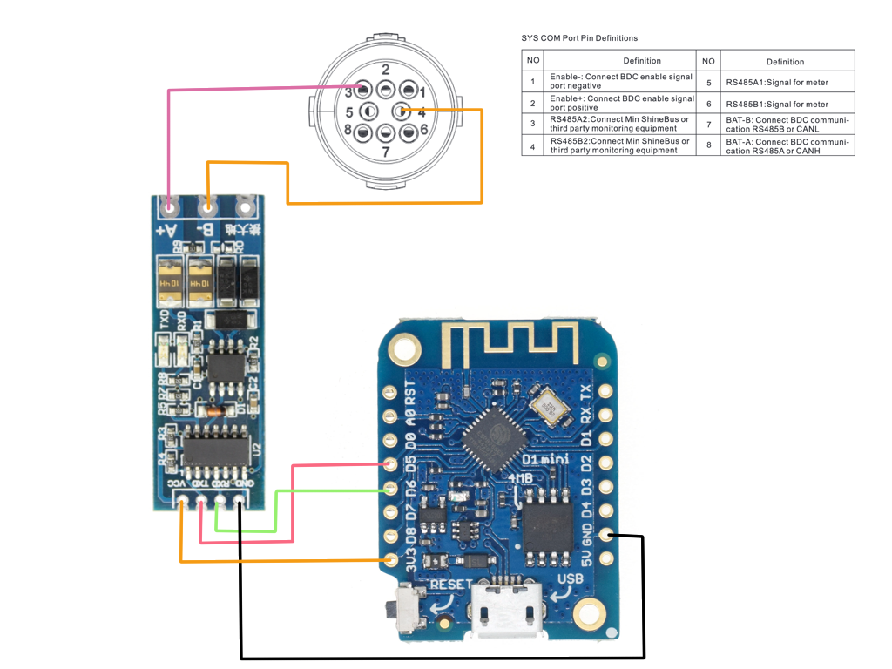

You'll need to power the ESP board using its USB port because MIN inverters don't provide power on the SYS COM port that we can use to power the ESP.

I use an old USB-A 5V/1A phone charger and it works well.

## Soyosource GTN inverters (display version)

Soyosource GTN inverters with the display don't include an external port to tap into the communication between the CPU and the display. However, they are very easy to modify and all you need to do is open the top cover and solder 4 wires from the cable going from the CPU board to the display board and axpose them in an external USB A female socket.

The CPU cable we will tap into to get the inverter data.
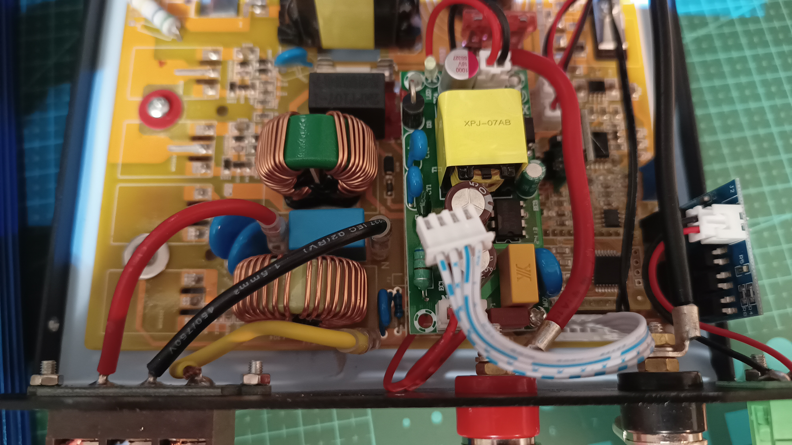

To tap into this cable we can solder cables under the display and expose them on a USB-A female socket.
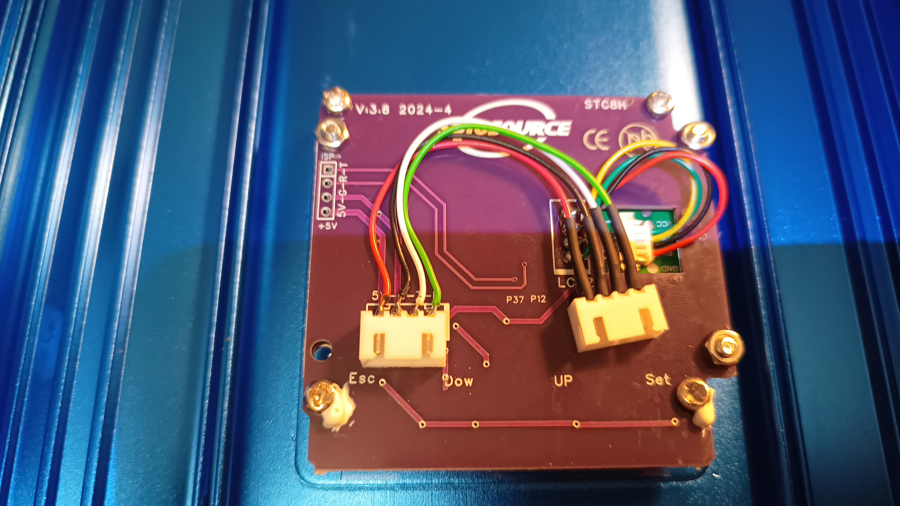

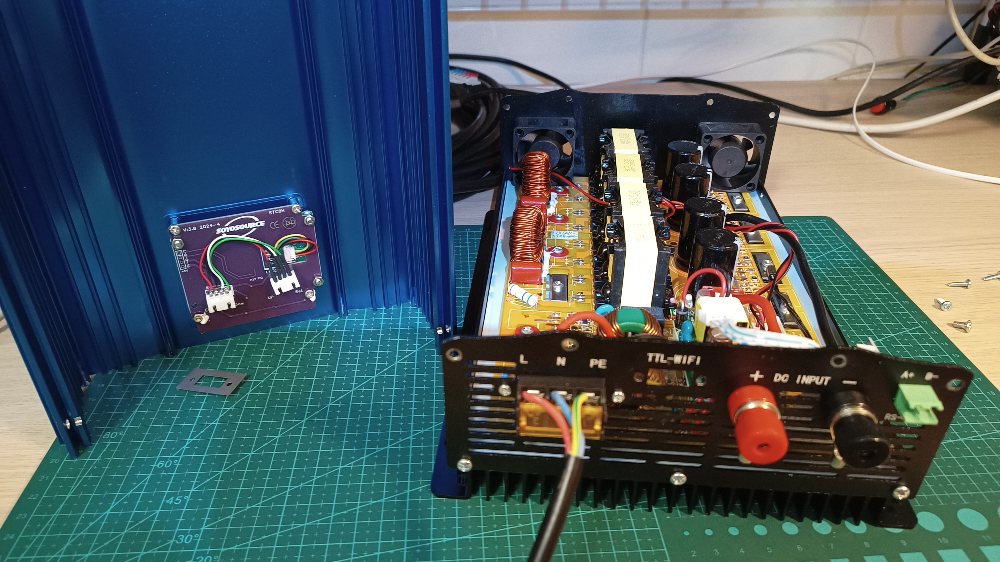

The cable to connect from the display to the USB-A female socket.
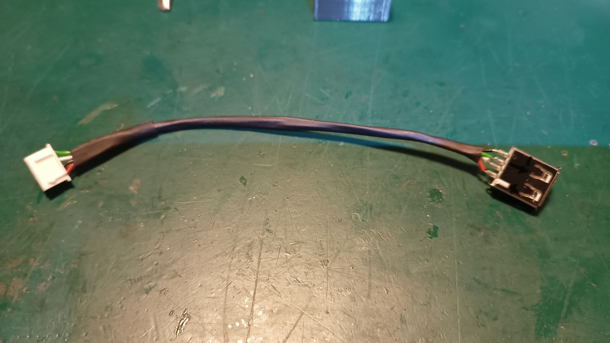

To hold the USB-A socket in its place I created [this piece of plastic](https://www.thingiverse.com/thing:7002014) that you can secure the USB-A socket to the case with fastners.
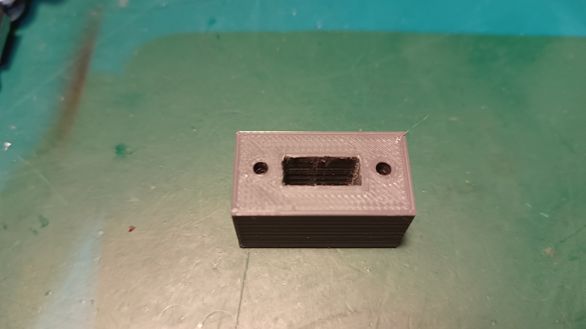

This is how it looks from the outside and from the inside.
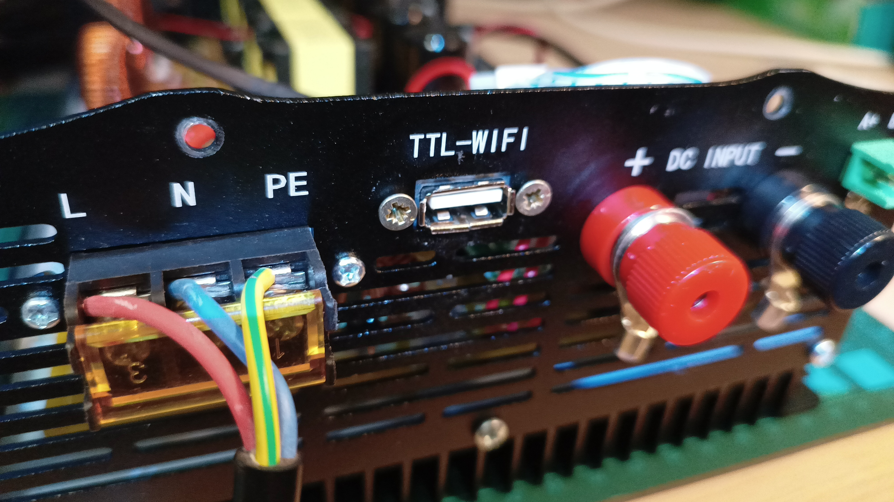
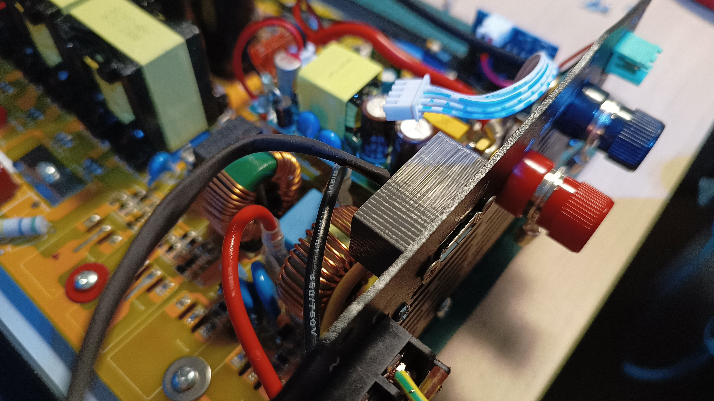

And after connecting it to the display
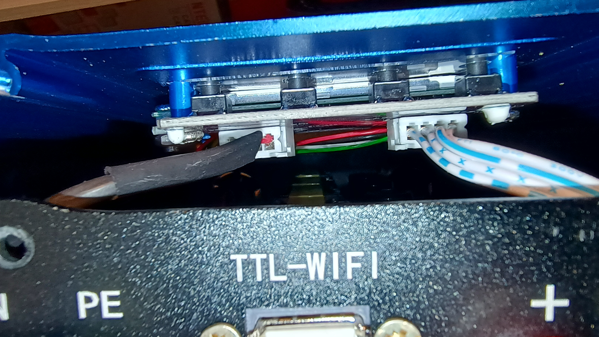
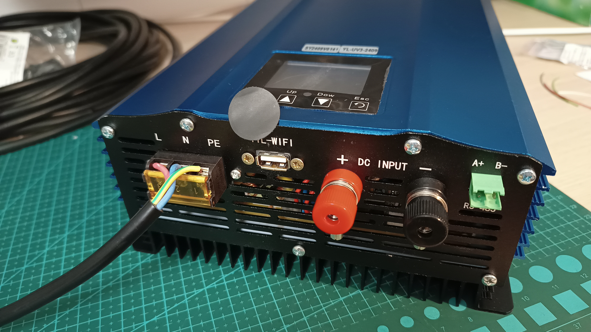


The communication between the CPU and the display is serial, 5V TTL, at 9600bps 8N1. The ESP8266 is a 3.3V chip and doesn't like 5V TTL so we need to convert it to 3.3V using a ADUM1201 board.

This inverter also includes an RS485 port, to connect a meter/limiter, which lets you control how much power the inverter injects into the grid (or home). 

When selecting the Soyosource inverter, the meter/limiter is emulated using a second serial connection running at 4800bps, 8N1. You'll need a RS485 adapter to connect the ESP8266 to this inverter port. The same RS485/TTL adapter board, used to communicate with the Growatt MIN inverters can be used. Finally the RS485 TX/RX pins are D3 and D1 respectively (see below).

Note: The meter/limiter function is totally optional and is only enabled on large ESP boards, ie not on the ESP-01 due to the lack of pins.

### Connections diagram
This is the full schematic on how to connect the Adum1201 and RS485/TTL boards to the ESP8266 board.

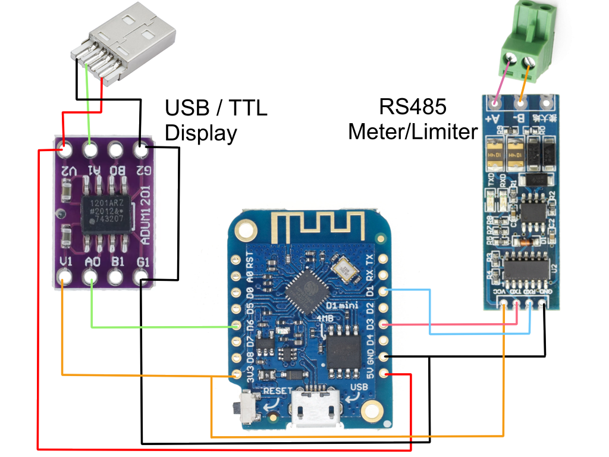

The ESP8266 + Adum1201 (for data collection only)
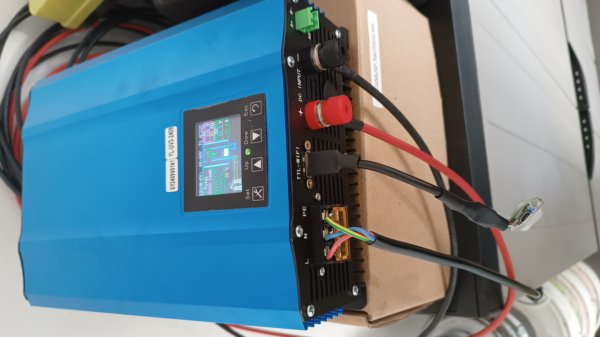

The ESP8266 + Adum1201 + RS485/TTL (for data collection and limiter function)
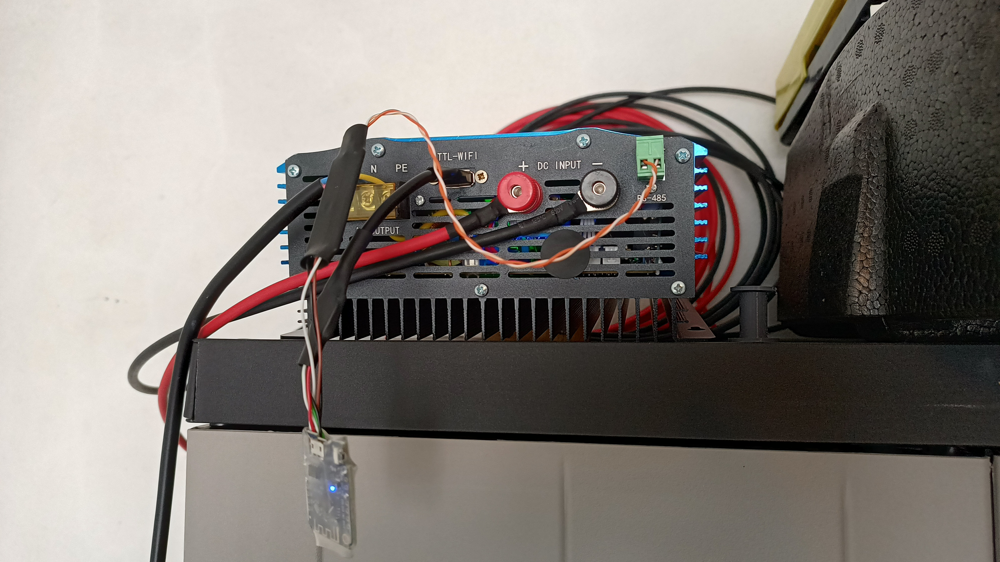

### Optional cover
I found [a cover for the inverter underside](https://www.thingiverse.com/thing:6207012) on ThingiVerse, made by [EngelbertFleischer](https://www.thingiverse.com/engelbertfleischer/designs). It's a tight fit so it will not fall even when the inverter gets warm.

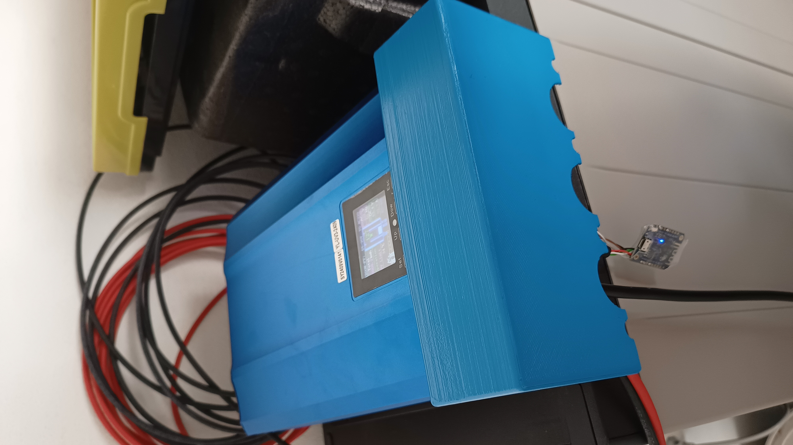

I printed it in white PLA (10% infill with tree supports) and used a spray can to paint it with a _close enough blue color_ (RAL5015).