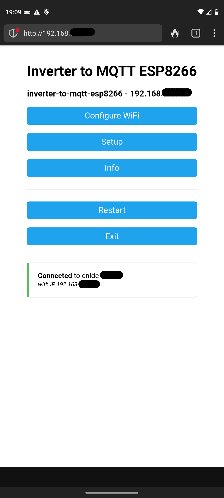
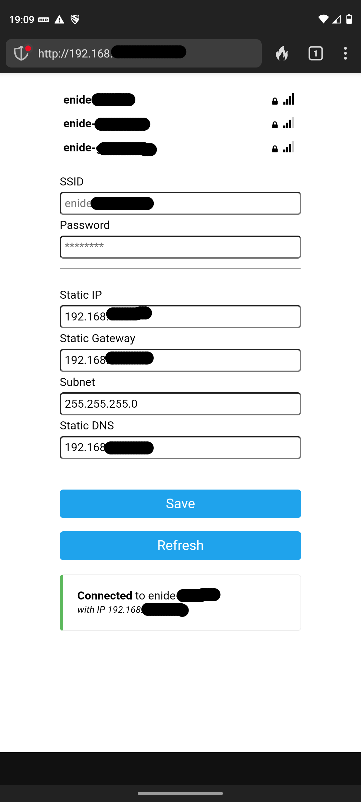
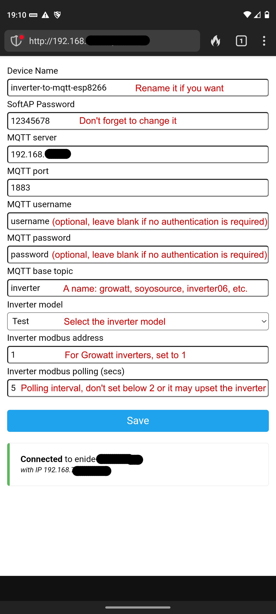

# Inverter to MQTT on ESP8266 (formerly growatt-sph-spa-esp8266)

This project's **main goal** is to **read energy data from solar inverters** and **publish this information to a MQTT server** of your choice without requiring any cloud access or external services. The **second goal** is to have **everything configurable via a web interface** without the need to recompile the code if you want to change something.

The inverter energy data is published to the MQTT server and can be consumed by any Home Automation solution that talks to the MQTT server.

Many ideas to implement this project came from other projects, most notably:
- [growatt-esp8266](https://github.com/jkairys/growatt-esp8266)
- [growatt-rs232-reader](https://github.com/lemval/growatt-rs232-reader)
- [soyosource-wifi-monitor](https://github.com/Stefino76/soyosource-wifi-monitor)
- [esphome-soyosource-gtn-virtual-meter](https://github.com/syssi/esphome-soyosource-gtn-virtual-meter/blob/main/components/soyosource_display/soyosource_display.cpp)
- [voltronic_ESP8266_MQTT](https://github.com/amishv/voltronic_ESP8266_MQTT/blob/main/src/communication.cpp)
- [docker-voltronic-homeassistant](https://github.com/ned-kelly/docker-voltronic-homeassistant/blob/master/sources/inverter-cli/inverter.cpp)

## Supported inverters

Currently, several **Growatt** inverter models, the **Soyosource** GTN with display and the **Voltronic** Axpert VM III are supported. I will add more inverters in the future.

I've been getting energy data from my **Growatt SPH 5000** since 2022 with an ESP8266 running this code and recently tested it on a **Growatt MIN 3000TL-XH**, which worked fine (as expected) since most recent Growatt inverters share the same register map. So it should work on other models like the **Growatt SPA** as well.

Support for the Soyosource GTN1000W / GTN1200W with display was added on v3.0.0 and it includes the RS485 limiter/meter function. This means you can control how much power the inverter will inject into the grid/home.

Support for Voltronic inverters is being slowly tested. As of v3.0.0 the code for the Axpert VM III is included but is in a very experimental state.

## Main features
- All configuration done via web interface (captive portal and web portal)
- Configuration is stored in SPIFFS as JSON files
- Inverter model/type is selected in the web portal
- Periodically polls data from the inverter and publishes it to the MQTT server via Wifi
- Polling period is configurable (in seconds)
- Some inverters are remotely controllable via MQTT topics. 
  - Example for Growatt SPH:
     - **Priority**: load, battery, grid
     - **Time intervals** (eg 00:00 - 23:59) for battery and grid priorities
     - Enable/Disable the **AC Charger**
     - Set **StopStateOfCharge** for battery and grid priorities
    - Set **PowerRating** for battery and grid priorities
  - Soyosource GTN
    - **Output power** is configurable / limited
- Prebuilt binaries, ie no need to recompile the code
- No cloud, all energy data is under your control

## Downloading
There are currently two pre-built binary files available:
- `generic`: for ESP-01 boards as it uses the hardware serial to communicate with the inverter
- `d1mini`: for NodeMCU/WemosD1 and larger boards, it uses a SoftwareSerial port on pins D5 and D6 to communicate with the inverter... the USB port is used for log messages

Check the [releases](https://github.com/enide-electronics/inverter-to-mqtt-esp8266/releases) page.

### Build instructions
See [BUILD.md](BUILD.md) for more details, if you really want to compile it on your own.

## Configuration
Everything is **configured via WiFiManager's Captive Portal / Web Portal** and the configuration is stored in the SPIFFS file system, in JSON files.

When powering up the board for the first time, after uploading the firmware, you are presented with a WiFi network named `inverter-to-mqtt-esp8266` from which you can start the configuration process. 

After connecting to the `inverter-to-mqtt-esp8266` network you should be able to access the Wifi settings, clicking in `Configure WiFi`, choose the Wifi network, type the password and click **Save**. 

Note: If you want to set a static IP address, you need to fill all fields (Static IP, Static gateway, Subnet and Static DNS) before clicking **Save**.

The board will then reboot and connect to the Wifi network you selected. The remaining settings can be made through the Web Portal on the ESP8266 IP address. These include the **inverter model/type**, **polling period**, **MQTT server address and credentials**, etc.

All parameters can be changed on the fly without the need for a restart, except for the `Device name` which will restart the ESP8266 because it is used on DHCP requests and also as the WiFi SoftAP name.

The `Inverter Model` combo box currently includes 5 inverter models:
* [Growatt SPH](https://en.growatt.com/products/sph-3000-6000tl-bl-up) (Single phase)
* [Growatt SPH-TL](https://en.growatt.com/products/sph-4000-10000tl3-bh-up) (Three phase)
* [Growatt MIN-XH](https://en.growatt.com/products/min-2500-6000tl-x-xh) (Single phase)
* [Soyosource GTN with display](https://www.soyo-dg.com/product_detail/14.html) (Single phase with limiter)
* [Voltronic Axpert VMIII](https://voltronicpower.com/en-US/Product/Detail/Axpert-VM-III-1.5KVA-3KVA-5KVA) (Single phase) :warning: **experimental**
* Test (Publishes random energy data and telemetry, for testing purposes)
* None (Default after a factory reset, no energy data, just telemetry)

### MQTT
The complete list of MQTT topics used by this project is available in the [TOPICS.md](TOPICS.md) file.
If you use Home Assistant, you can grab the list of preconfigured sensor entities from the [HOMEASSISTANT.md](HOMEASSISTANT.md) file to help you get started.

## Hardware

### Minimum hardware
If you're on a budget, start with an ESP-01 board but be mindful that it will have limited functionality.
* only one serial connection will be available
  * report of energy data will work
  * inverter remote control will work as long as it uses the same hardware serial port (Growatt inverters will work)
* No logs
* No extra LEDs to notify you of any remote control requests
* No factory reset button

Anything besides the hardware serial will not be available on the ESP-01 because it doesn't have enough pins.

### Recommended hardware
I recommend choosing a "large" board like a [Wemos D1 mini lite](https://www.wemos.cc/en/latest/d1/d1_mini_lite.html) or [NodeMCU v3](https://www.instructables.com/Getting-Started-With-ESP8266LiLon-NodeMCU-V3Flashi/), since they have lots of pins which allow you to make all the connections to your inverter, have the extra LEDs and the factory reset button.

 The [Wemos D1 mini lite adapter board schematic in HARDWARE.md file](HARDWARE.md#wemos-d1-mini-and-similar) contains all the details regarding which pins are used by the extra LEDs and the button.

You'll also need a converter chip/board (MAX3232, MAX485, ADUM1201) to interface the ESP8266 board to your inverter communications port (or ports).

Again, look in the [HARDWARE.md](HARDWARE.md) file for all the details on how to connect your ESP8266 board to the supported inverters.

